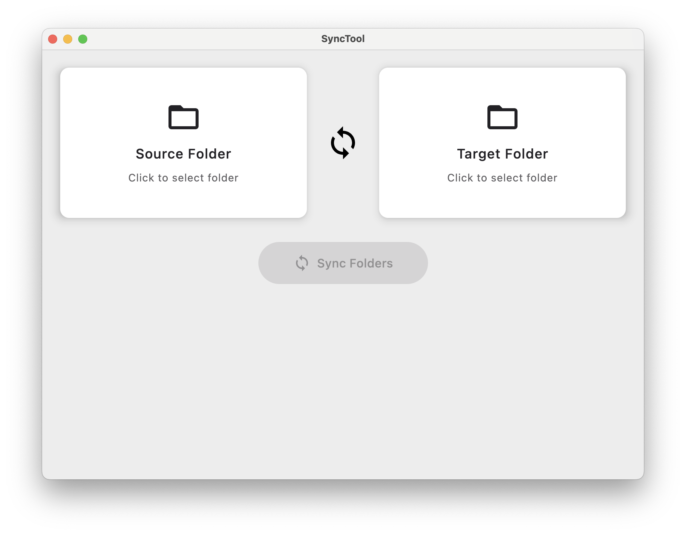

# SyncTool

A super simple, bare-bones folder synchronization built with Compose Multiplatform. SyncTool provides a simple and intuitive interface for syncing files from a source folder to a target folder, with progress tracking.



## Features

- 🎯 **One-way synchronization**: Safely sync files from source to target without deletions

## Installation

### Prerequisites

- Java 11 or higher
- macOS, Windows, or Linux

### Building from Source

1. Clone the repository:
```bash
git clone https://github.com/yourusername/SyncTool.git
cd SyncTool
```

2. Run the application:
```bash
./gradlew :composeApp:runDistributable
```

3. Or build a distributable package:
```bash
./gradlew :composeApp:createDistributable
```

The distributable will be created in `composeApp/build/compose/binaries/main/app/`

## Usage

1. **Select Source Folder**: Click on the "Source Folder" card to choose the folder you want to sync from
2. **Select Target Folder**: Click on the "Target Folder" card to choose the destination folder  
3. **Start Sync**: Click the "Sync Folders" button to begin the synchronization process
4. **Monitor Progress**: Watch the real-time progress indicator showing "X / Y files" as the sync proceeds

### Sync Behavior

- **Additive Only**: Files are never deleted from the target folder
- **Update Policy**: Only newer files from source will overwrite files in target
- **New Files**: All new files from source are copied to target
- **Structure Preservation**: Directory structure is maintained exactly

## Technical Details

### Architecture

- **Framework**: Compose Multiplatform for Desktop
- **Language**: Kotlin
- **UI**: Material 3 Design System
- **File Operations**: FileKit for native folder selection
- **Sync Engine**: rsync with manual fallback

### Sync Implementation

The application uses a dual-mode approach:

1. **Primary Mode**: Uses `rsync` command with optimized flags:
   ```bash
   rsync -av --info=progress2 --update [source] [target]
   ```

2. **Fallback Mode**: Manual file copying with progress tracking when rsync is unavailable

## License

This project is licensed under the MIT License - see the LICENSE file for details.

## Learn More

- [Kotlin Multiplatform](https://www.jetbrains.com/help/kotlin-multiplatform-dev/get-started.html)
- [Compose Multiplatform](https://www.jetbrains.com/lp/compose-multiplatform/)
- [FileKit Documentation](https://github.com/vinceglb/FileKit)